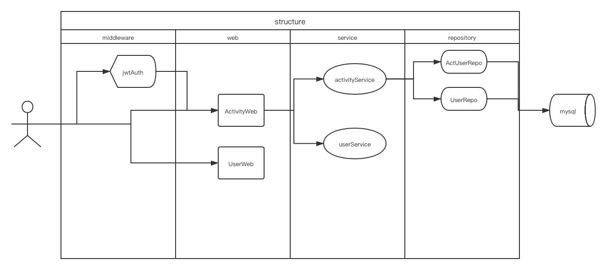

# entrytask
***
## 一. 背景和目的
> entrytask 项目：实现一个聚会活动网站，包括：用户端网站、运营后台。两个站点代码文件放置在同一个项目中，且只实现API，不实现前端。

### 用户端网站
1. 用户可使用用户名、密码登录。可查看自己的邮箱、头像。
2. 未登录/已登录用户 都可以查看到当前正在进行的所有活动、以及已经结束的活动。所有活动页面包含有活动标题、活动开始时间、结束时间、自己是否已参加等信息；
3. 未登录用户 都可根据活动分类、活动开始时间、活动结束时间(均属可选)搜索活动；搜索结果也包含有活动标题、活动开始时间、活动结束时间。已登录用户可查看自己是否已参加等信息；
4. 未登录用户 可查看活动详情页，页面信息包括有：活动标题、活动开始时间、结束时间、活动详细描述、活动地点、参与的活动的所有用户的用户名、头像、活动评论，已登录用户还可以查看自己是否参加此活动。
5. 已登录用户可在活动详情页参加活动、退出活动；
6. 已登录用户可在活动详情页发表评论；
7. 用户可在个人中心查看到自己参加的所有活动
### 运营后台
1. 运营人员可使用用户名、密码登录运营后台；其它所有操作都需要登录后才能进行；
2. 运营人员可查看、添加、编辑、删除活动；
3. 运营人员可查看、添加、编辑、删除活动分类；
4. 运营人员可查看到所有的用户（昵称、邮箱、头像）；

## 二. 逻辑架构设计

如上图所示；本项目本质上是一个无状态的http服务。从总体来看分为4层
1. middleware：中间件层，被gin框架管理。用于授权/权限控制/限流熔断等功能
2. web: 接口层，用于进行参数校验/细致权限检查/业务整合/格式化返回值等功能
3. service: 业务层，整合repository对象进行核心的业务逻辑操作
4. repository: db层，直接对接数据库，进行原始的crud操作

## 三. 接口设计
Yapi地址：https://api.seller.shopee.io/project/2966/interface/api

## 四. 数据库设计
详细说明google doc地址：https://docs.google.com/spreadsheets/d/1ne960EqvggH1Yqy0EaMcm52-vvj41UiWUZ_CSJ0_oF4/edit#gid=0

## 五. 部署与测试
### 项目部署
1. 环境需求
   1. mysql 5.7 以上
   2. golang 1.17 以上
2. `go env` 确保 `GO111MODULE=ON` 开启 gomod模式
3. 执行 `make build` 会在release文件夹下自动变异 `server` 和 `tool`
4. 初始化 mysql 数据库
   1. `mysql -u{user} -p{passwd}` 进入mysql
   2. `source {path}/entrytask/sql/*.sql`
5. 根据部署环境编辑 `etc/config.yml` 配置文件。配置文件说明如下
```azure
server:
  port: 8080         // 监听端口
  read-timeout: 60   // http读超时时间
  write-timeout: 60  // http写超时时间

app:
  run-mode: debug           // 运行模式。debug模式下开启gin调试信息和 pprof监控
  page-size: 10             // 默认的分页大小
  log-path: ""              // 日记存放路径，如果为空，则输出到stdout
  identity-key: idname      // 身份密钥，用于jwt加密
  aes-key: 1234567887654321 // aes加密密钥，用于jwt加密
  file-path: "/home/file"   // 存放上传文件的地址

database:
  type: mysql           // 数据库类型，目前只支持mysql
  user: root            // 数据库用户
  password: Admin@123   // 数据库密码
  host: 127.0.0.1:3306  // 数据库地址
  name: "test"          // 数据库名称
  sql-output: false     // 是否打印sql调试信息
  max-idle-conn: 10     // 数据库最大连接数
  max-open-conn: 100    // 数据库最大连接数
```
6. `./release/server -c ./etc/config.yml` 使用命令开启服务
7. `curl http://127.0.0.1:{port}/ping` 返回 `{"code":0,"message":"Pong!","data":null}` 则http服务正常开启

### 项目测试
1. 单元测试用例和性能测试用例均没有mock数据库，所以测试环境依然需要进行`项目部署`上的第四步初始化数据库
2. 修改单元测试配置数据：internal/repository/base_test.go（参照上文的配置说明）
3. `make unittest` 执行单元测试用例
4. 性能测试方法请参照第七节中的测试报告内容

## 六. 使用的核心第三方库介绍
1. go-gin  https://github.com/gin-gonic/gin 高性能web框架
2. gorm  https://github.com/go-gorm/gorm mysql数据库操作框架
3. gin-jwt  https://github.com/appleboy/gin-jwt/ 给予go-gin开发的jwt认证中间件
4. facebookgo/inject  https://github.com/facebookarchive/inject 脸书开源的依赖注入框架

## 七. SLA
性能测试报告google doc地址：https://docs.google.com/document/d/1ZJQ-OVqbi135BtirbYEv5x4_wxIlvfv0oFU-BWq00D0/edit